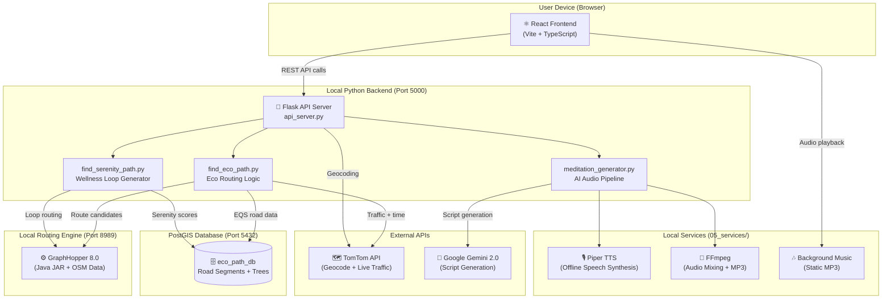
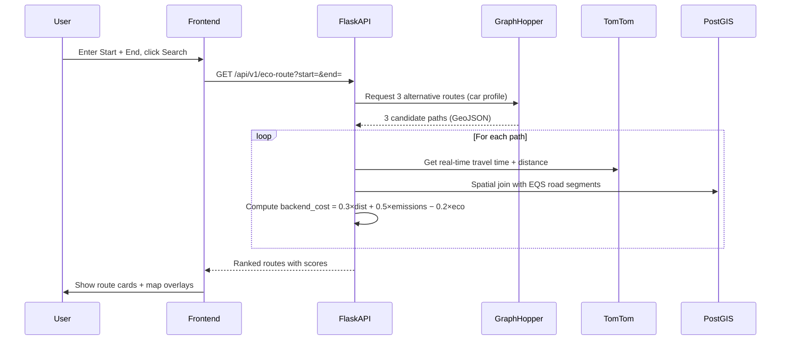
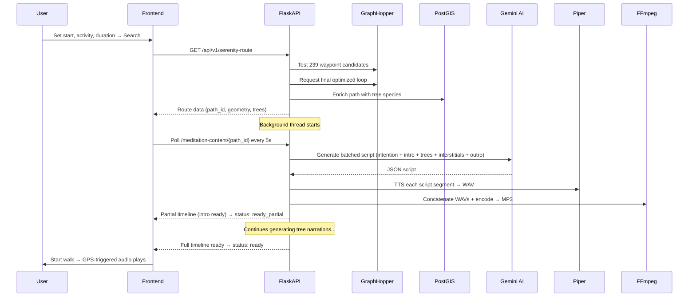

# Technical Design Document
## Eco-Path Pune: AI-Powered Eco-Routing & Guided Meditation Walk System

> **Version:** 1.0 | **Date:** February 2026 | **Status:** Active Development

---

## 1. Executive Project Summary

**Eco-Path Pune** is a full-stack, geospatial urban mobility application designed for the city of Pune, India. It solves two distinct but complementary problems:

1. **Eco-Routing (Driving Mode):** It helps drivers find routes that are not just fast, but *ecologically optimal* — prioritizing paths with higher tree canopy coverage, lower predicted vehicular emissions, and greater urban biodiversity. Unlike standard navigation apps that optimize for time alone, Eco-Path uses a custom multi-variable cost function that weighs distance, carbon emissions, and a pre-computed Eco Quality Score (EQS) for every road segment in the city.

2. **Serenity Walk (Wellness Mode):** It generates a personalized, AI-narrated guided meditation walk. A user specifies their start location, activity type (walk/jog/cycle), and desired duration. The system computes an optimal loop route through the most serene areas, then—entirely in the background—uses Google Gemini to write a bespoke meditation script inspired by the actual trees along that specific path, converts it to speech using a local TTS engine, and delivers it to the user as a live, GPS-triggered audio experience.

The project represents a rare fusion of **GIS/geospatial analysis**, **graph-based routing**, **generative AI**, **offline TTS synthesis**, and **real-time audio orchestration** in a single product.

---

## 2. System Architecture

### 2.1 High-Level Architecture



### 2.2 Data Flow — Driving Mode



### 2.3 Data Flow — Wellness / Meditation Mode



---

## 3. Core Logic & Algorithms

### 3.1 The Eco Quality Score (EQS) — Road Segment Scoring

Every road segment in Pune's western zone has been pre-processed and stored in PostGIS with the following normalised sub-scores:

| Score Component | Column | Description |
|---|---|---|
| Canopy Coverage | `s_canopy_norm` | Avg tree canopy diameter over segment |
| CO₂ Sequestration | `s_co2_norm` | Estimated CO₂ absorbed by roadside trees |
| Biodiversity | `s_bio_norm` | Number of unique species per segment |
| **Composite EQS** | `static_eqs` | Weighted combination of all above |

### 3.2 Eco-Route Cost Function

The "brain" of the routing engine is a custom cost function balancing three competing factors:

```
backend_cost = (0.3 × path_length_km)
             + (0.5 × predicted_emissions_kg)
             − (0.2 × Σ EQS over segments)
```

**Emission Prediction** uses a speed-dependent emission factor model:
```python
emission_factor(speed_kmh) = 80 + (6500 / speed_kmh) + (0.03 × speed_kmh²)  # g/km
```
This is a quadratic-reciprocal model capturing both low-speed (stop-start) and high-speed aerodynamic drag emissions.

**Frontend Score** mapping (non-linear, capped 10–99.9):
```python
frontend_score = 100 × e^(−0.05 × backend_cost)
```

### 3.3 Serenity Loop Algorithm

Finding the optimal loop for a target duration is a custom waypoint search problem:

1. **Target Distance:** `speed_kmh × duration_min / 60`
2. **Candidate Filtering:** Only road segments in the **top 40th percentile** by serenity score qualify as waypoints
3. **Best Waypoint Search:** Iterates over all candidate centroids (up to 239), tests an out-and-back routing via GraphHopper for each, and selects the one minimising `|actual_distance − target_distance|`
4. **Path Enrichment:** Finds all trees within **15m buffer** of the final path using spatial indexing, projects them onto the path line, and sorts by distance

### 3.4 AI Meditation Pipeline

A sophisticated multi-stage generative pipeline:

1. **Narration Point Selection:** Evenly samples 2–8 trees from the middle 80% of the path (avoids very start/end), prioritising unique species
2. **Intent Generation:** Asks Gemini to infer a "walk intention" (e.g., "noticing resilience") from the list of tree species
3. **Batched Script Generation:** A single Gemini call generates ALL content in one JSON response:
   - Walk intention + inspirational quote
   - Introduction (3–4 sentences)
   - Per-tree reflective narration (2–3 sentences each)
   - 5 generic interstitial mindfulness prompts
   - Conclusion
4. **Audio Synthesis:** Each script segment → Piper TTS → WAV → sentence-pause injection via regex → FFmpeg concat → final MP3
5. **Progressive Delivery:** Intro MP3 is saved first as `_timeline_partial.json` so the user can start walking before all audio is ready

### 3.5 Live Audio Orchestration (Frontend)

The `AudioOrchestrator` runs an interval loop every **2 seconds** and applies a priority hierarchy:

```
Priority 0: Is user within 30m of route end? → Queue outro → play when narration clears
Priority 1: Is user within 15m of an unplayed scripted tree? → Play tree narration
Priority 2: Has it been >25s since last narration? → Play next interstitial from stock
Background: If interstitial stock ≤ 2 → Fetch new batch from Gemini (JIT generation)
```

---

## 4. Feature Roadmap (Currently Implemented)

### Driving Mode
- [x] Multi-point address geocoding via TomTom
- [x] Up to 3 alternative route candidates via GraphHopper
- [x] Real-time traffic-aware travel time via TomTom Routing API
- [x] Per-route EQS scoring with canopy, CO₂, and biodiversity breakdown
- [x] Custom eco-cost ranking and frontend score (10–99.9)
- [x] Turn-by-turn navigation instructions
- [x] Analytics modal with per-route eco breakdown
- [x] Simulated GPS navigation mode (auto-advances along route)

### Wellness / Meditation Mode
- [x] Activity-aware loop generation (walk/jog/cycle at calibrated speeds)
- [x] Duration-targeted route planning (target distance from minutes)
- [x] Serenity-filtered waypoint selection (top 40th percentile)
- [x] Tree species enrichment from pre-built knowledge base (807KB JSON)
- [x] Gemini-powered batched script generation
- [x] Offline Piper TTS synthesis (no cloud TTS dependency)
- [x] FFmpeg audio pipeline (silence injection, WAV concat, MP3 encode)
- [x] Progressive timeline delivery (partial → full)
- [x] GPS-proximity-triggered audio playback with 15m threshold
- [x] JIT interstitial generation and stock management
- [x] Mute/unmute and speech-to-music balance slider
- [x] Live tree species markers on map during walk
- [x] CurrentTreeCard display + tree species pinning
- [x] Scrollable unique-species carousel in nav panel
- [x] Post-walk Journey Reflection screen with inspirational quote
- [x] Partial-journey reflection (exits before 98% completion)
- [x] Dark mode support across all UI

---

## 5. Unique Selling Points (USPs)

### 🌱 Multi-Dimensional Eco-Scoring (Not Just "Green Routes")
Most eco-routing apps flag "low-emission" routes based on speed alone. This system spatially intersects every candidate path against a pre-computed GIS dataset of road-level biodiversity, CO₂ sequestration, and canopy coverage — derived from actual tree census data.

### 🎙️ Fully Offline AI Audio (Zero Cloud TTS Cost)
The meditation audio pipeline runs **entirely on-device** for TTS. Piper is a local, open-source neural TTS model. Only the *script generation* step uses a cloud API (Gemini). Once the script is written, all audio synthesis is free and local — critical for a project with no revenue.

### 🌳 Content Grounded in Real Urban Tree Data
Meditation narrations are not generic nature prompts. They reference the *specific trees* on the *specific path* the user is walking, using a curated knowledge base of Pune's tree species with ecological themes, common names, and CO₂ data. This makes each meditation unique and place-specific.

### 📍 GPS-Proximity Audio Triggering (Not Timed)
Unlike podcast-style guided walks (timed to a default pace), narrations trigger when the user *physically arrives* near a tree — regardless of pace. A user who stops to look at a bird will still hear the right narration at the right tree.

### ⚡ Progressive Content Delivery
The partial timeline pattern (save intro first, continue generating in background) means the user is never blocked. They receive the intro audio within ~2 seconds of the route being confirmed, and the full meditation continues loading behind the scenes.

### 🔄 Self-Replenishing Interstitial System
The orchestrator maintains an audio "stock" of mindfulness prompts and proactively fetches more from Gemini before they run out — creating an endless, non-repetitive ambient experience for longer walks.

---

## 6. Use Cases

| Use Case | Description |
|---|---|
| **Urban Commuter Eco-Routing** | Drivers who want to make a positive environmental impact by choosing greener commute routes without sacrificing too much time |
| **Health & Wellness Tourism** | City tourists wanting a curated, guided nature-walk experience — uniquely personalised to the exact streets they'll walk |
| **Urban Forestry Research** | Researchers studying the distribution and accessibility of urban green space, using EQS data as a proxy for urban forest quality |
| **Municipal Planning Tool** | City planners assessing which road corridors have the highest eco-value — routes with consistently high EQS suggest priority tree planting areas |
| **Corporate Wellness Programs** | Companies offering employees structured, AI-guided nature break walks during lunch hours |
| **FYP / Academic Demonstration** | A complete end-to-end demonstration of applied GIS, routing algorithms, generative AI, and real-time audio engineering |

---

## 7. Technical Stack

### Backend

| Component | Technology | Purpose |
|---|---|---|
| API Framework | **Python / Flask 3.x** | REST API server, request routing |
| Geospatial Engine | **GeoPandas + Shapely** | Spatial joins, path analysis, projections |
| Database ORM | **SQLAlchemy + PostGIS** | Road segment EQS data access |
| Routing Engine | **GraphHopper 8.0** (Java) | Path finding, alternative routes, turn-by-turn |
| Map Data | **OpenStreetMap PBF** (196MB) | Western Pune road network |
| AI / LLM | **Google Gemini 2.0 Flash** | Meditation script generation |
| TTS Engine | **Piper** (local, ONNX) | Offline neural text-to-speech |
| Audio Processing | **FFmpeg** | WAV concat, silence injection, MP3 encoding |
| Traffic Data | **TomTom Routing API** | Real-time travel time and emissions context |
| Geocoding | **TomTom Search API** | Address → Coordinates lookup |
| Concurrency | **ThreadPoolExecutor** | Background meditation generation without blocking the API |

### Frontend

| Component | Technology | Purpose |
|---|---|---|
| Framework | **React 18 + TypeScript** | Component-based UI |
| Build Tool | **Vite** | Dev server + bundling |
| Styling | **Tailwind CSS** | Utility-first styling |
| Animation | **Framer Motion** | Transition animations, spring physics |
| Mapping | **MapView component** (Leaflet/Mapbox) | Route rendering, tree markers |
| State Management | **React useState + useCallback** | Local component state |
| Audio Layer | **Web Audio API (HTMLAudioElement)** | Music + narration playback |
| Icons | **Lucide React** | UI icons |
| Geolocation | **Browser Geolocation API** | Real GPS tracking |

### Data

| Dataset | Format | Size | Description |
|---|---|---|---|
| Pune Road EQS | PostGIS table | ~10MB | Pre-computed eco scores per road segment |
| Tree Census | PostGIS table (WGS84) | ~50MB | All trees with species, canopy diameter, GPS |
| Tree Knowledge Base | JSON | 807KB | Species themes, eco data, common names |
| OSM Road Network | `.osm.pbf` | 196MB | Western Pune street network for routing |
| SRTM Elevation | GeoTIFF tiles | ~50MB | Elevation data for routing profiles |

---

## 8. Deployment Architecture (Current: Local Dev)

```
localhost:5000  →  Flask API Server        (api_server.py)
localhost:8989  →  GraphHopper Routing     (graphhopper-web-8.0.jar)
localhost:5432  →  PostgreSQL + PostGIS    (eco_path_db)
localhost:5173  →  Vite Dev Server         (React Frontend)
```

> **Note:** The frontend is served separately and communicates with the Flask backend via proxied `/api/v1/*` calls. The Vite dev config proxies these to port 5000.
